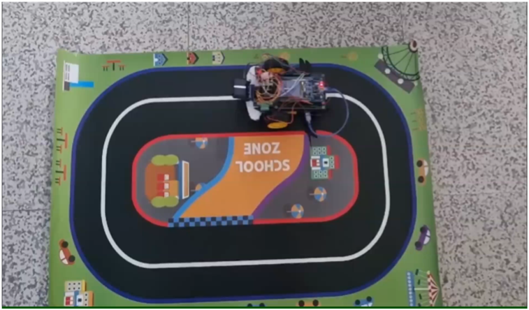
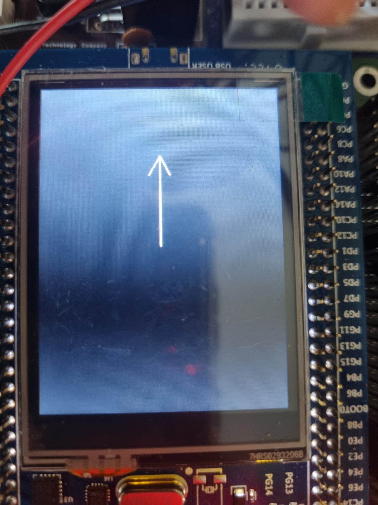
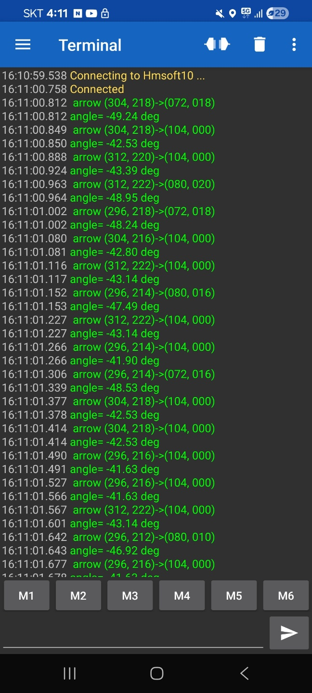

# STM32 HuskyLens 라인트레이서

> HuskyLens(AI 카메라)가 인식한 라인 방향을 받아, 라인 위치 편차와 방향 각도를 함께 보정하는 이중 PID로 주행하는 라인트레이서

<p align="center"></p>

| 항목 | 내용 |
| --- | --- |
| 구분 | 교과 프로젝트 (제어기설계, 2026년 1학기), 개인 과제 |
| MCU | STM32F429I-Discovery (STM32F429ZI, 168 MHz, HAL, STM32CubeIDE) |
| 센서 | HuskyLens (라인 추적 모드, UART) |
| 담당 | 주행 제어 알고리즘, PID 모듈, LCD 방향 표시, 블루투스 모니터링 |

## 동작 모습

| LCD 방향 화살표 | 블루투스 실시간 로그 |
| --- | --- |
|  |  |

## 구현 범위

| 구분 | 내용 |
| --- | --- |
| 수업 제공 | DC 모터 드라이버, HuskyLens 통신 라이브러리, LCD 드라이버(BSP) |
| 직접 구현 | 이중 PID 주행 제어(`CarDriving`), LCD 방향 화살표(`DrawDirectionArrow`), 시작 버튼과 모니터링 출력 |
| 재사용 | PID 모듈(`pid.c`): 졸업작품 AGV를 위해 직접 만든 모듈을 가져와 사용 |

제공된 드라이버는 수업 자료라 이 레포에는 포함하지 않았습니다.

## 하드웨어와 주변장치

| 주변장치 | 용도 | 설정 |
| --- | --- | --- |
| UART5 | HuskyLens 통신 | 9600 bps |
| USART1 | 블루투스(HM-10) 모니터링 출력 | 230400 bps |
| TIM9 CH1, CH2 | 좌우 DC 모터 PWM | 20 kHz |
| LTDC + LCD | 라인 방향 화살표 표시 | 보드 내장 LCD |
| PA0 (USER 버튼) | 주행 시작 | |

## 주행 제어

HuskyLens는 라인 추적 모드에서 라인을 화살표(시작점, 끝점 좌표)로 알려줍니다. 이 화살표에서 두 가지 값을 구해 각각 PID로 0에 맞춥니다.

| 제어기 | 입력 | 의미 | Kp | Ki | Kd |
| --- | --- | --- | --- | --- | --- |
| Diff | 화살표 시작점 x - 화면 중앙(160) | 라인이 좌우로 벗어난 정도 | 0.5 | 0 | 0.005 |
| Angle | `atan2`로 구한 화살표 기울기 (deg) | 라인 방향과 차체 방향의 차이 | 1.5 | 0 | 0.030 |

두 PID 출력을 더해 기본 속도에 좌우 반대 부호로 반영합니다.

```c
CarVelocity_L = basePwm - (Diff.pidOutput + Angle.pidOutput);
CarVelocity_R = basePwm + (Diff.pidOutput + Angle.pidOutput);
```

위치 편차만 보면 라인 위에 있어도 비스듬히 달려 곡선에서 늦게 반응하고, 각도만 보면 라인과 나란하지만 옆으로 밀려난 상태를 바로잡지 못합니다. 그래서 두 값을 함께 보정했습니다.

## 동작 흐름

1. LCD, 모터, 타이머, HuskyLens 초기화 (HuskyLens에 Knock 명령을 보내 응답 확인)
2. USER 버튼을 누르면 주행 시작
3. HuskyLens에서 화살표 좌표를 받아 위치 편차와 각도 계산
4. 두 PID로 좌우 바퀴 속도를 계산해 모터 구동
5. 화살표 5개마다 LCD 화살표 갱신, 블루투스로 좌표와 각도 출력

## 모니터링

- **LCD**: 이전 화살표를 배경색으로 지우고 새 화살표를 그려, 화면 전체를 다시 그리지 않고 방향만 갱신
- **블루투스**: 주행 중에는 PC와 선을 연결할 수 없어서, 스마트폰 터미널로 화살표 좌표와 각도를 실시간 확인
- 출력은 5회에 한 번만 해서, 출력 때문에 제어 주기가 늦어지지 않도록 함

## 졸업작품과의 관계

PID 모듈(`pid.c`, `pid.h`)은 같은 학기에 진행한 [졸업작품 AGV](https://github.com/juwon1113/AGV-Logistics-Firmware)를 위해 직접 만들면서, 다른 프로젝트에서도 쓸 수 있도록 일부러 별도 파일로 모듈화했습니다. 제어기마다 `PID_t` 구조체를 하나씩 만들어 쓰는 구조라, 이 과제에서도 코드를 고치지 않고 그대로 가져와 두 개의 제어기(위치 편차, 각도)로 사용했습니다.

이 레포의 `PID/` 폴더에는 **졸업작품에서 개선한 최종 버전**을 넣었습니다. 함수 이름과 인자가 그대로라 `main.c`는 수정 없이 사용할 수 있습니다.

| 구분 | 과제 당시 사용한 버전 | 이 레포의 버전 (졸업작품 최종) |
| --- | --- | --- |
| anti-windup | 적분값을 상한·하한으로 자르는 방식 | 출력이 포화되고 오차가 같은 방향이면 적분을 멈추는 조건부 적분 |
| 상태 초기화 | 없음 | `PID_Reset()` 추가 (동작이 바뀔 때 적분값과 이전 오차 초기화) |

> 과제 당시 라인트레이서는 이전 버전으로 동작했고, 최종 버전으로는 라인트레이서 하드웨어에서 다시 테스트하지 않았습니다. 이 과제의 게인은 Ki = 0이라 anti-windup 방식 차이는 동작에 영향을 주지 않습니다.

## 한계

- 제어가 `HAL_Delay(5)` 루프 안에서 돌아서, HuskyLens 통신 시간에 따라 실제 주기가 달라짐. PID의 `dt`는 5 ms로 고정이라 D항 크기가 실제와 어긋날 수 있음 → 타이머 인터럽트로 주기를 고정하는 것이 맞음 (졸업작품 AGV에서는 10 ms 타이머 인터럽트로 제어)
- 새 화살표를 받지 못한 주기에도 직전 값으로 제어를 계속함

## 소스 코드

```
├── firmware/
│   ├── LineTracer.ioc     CubeMX 설정
│   ├── Core/Src/main.c    주행 제어, LCD 표시, 모니터링
│   └── PID/               pid.c, pid.h
└── images/
```
